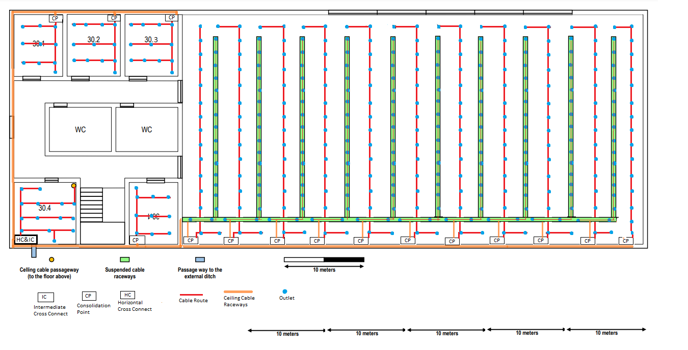

RCOMP 2019-2020 Project - Sprint 1 - Member 1190693 folder
===========================================
(This folder is to be created/edited by the team member 3333333 only)

#### This is just an example for a team member with number 3333333 ####
### Each member should create a folder similar to this, matching his/her number. ###
The owner of this folder (member number 3333333) will commit here all the outcomes (results/artifacts/products)		       of his/her work during sprint 1. This may encompass any kind of standard file types.

# Building 3:

## **Ground floor:**

### Room 30.1: 
    - Dimensions: 6.1 m x 7.69 m
    - Area: 47 m2
    - Number of Outlets: 10 
### Room 30.2: 
    - Dimensions: 6.9 m x 7.69 m
    - Area: 53 m2
    - Number of Outlets: 10
### Room 30.3: 
    - Dimensions: 6.5 m x 7.69 m
    - Area: 50 m2
    - Number of Outlets: 10
### Room 30.4:
    - Dimensions: 7.69 m x 7.69 m
    - Area: 60 m2
    - Number of Outlets: 12
### Room 30.5: 
    - Dimensions: 6.1 m x 7.69 m
    - Area: 47 m2
    - Number of Outlets: 10
### Right Open Area: 
    - Dimensions: 58.5 m x 29.2 m
    - Area: 1708 m2
    - Number of Outlets: 340

## **First floor:**

### Room 31.1: 
    - Dimensions: 6.1 m x 7.69 m
    - Area: 47 m2
    - Number of Outlets: 10 
### Room 31.2: 
    - Dimensions: 6.5 m x 7.69 m
    - Area: 50 m2
    - Number of Outlets: 10
### Room 31.3: 
    - Dimensions: 6.5 m x 11.69 m
    - Area: 76 m2
    - Number of Outlets: 16
### Room 31.4:
    - Dimensions: 7.69 m x 7.69 m
    - Area: 60 m2
    - Number of Outlets: 12
### Room 31.5: 
    - Dimensions: 6.1 m x 7.69 m
    - Area: 47 m2
    - Number of Outlets: 10
### Right Open Area: 
    - Dimensions: 58.5 m x 29.2 m
    - Area: 1708 m2
    - Number of Outlets: 340