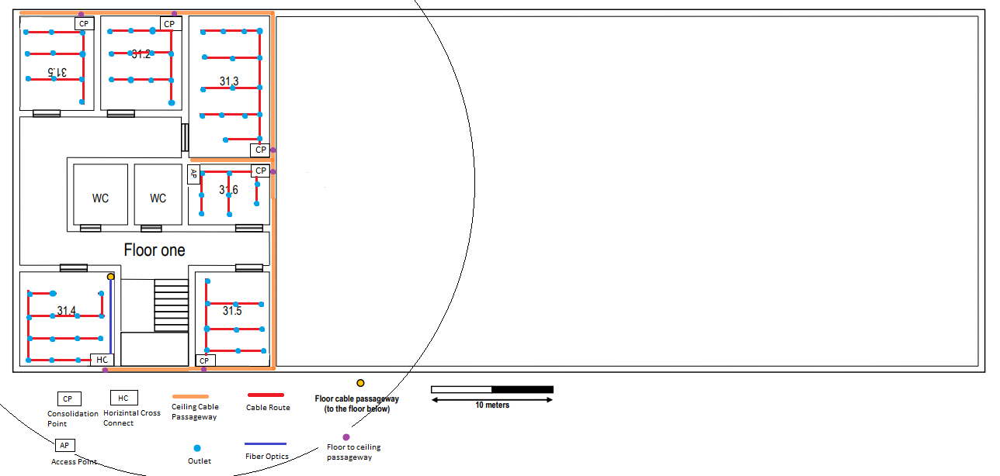

RCOMP 2019-2020 Project - Sprint 1 - Member 1190693 folder
===========================================

# Building 3:

## **Ground floor:**

    - Dimensions: 78.5 m x 30 m
    - Area: 2355 m2

- The Intermediate Cross Connector and the Horizontal Cross Connector are in the same enclosure in room 30.4 since its where the passage to the external ditch and the passage way to the floor above are;
- Each room has a Consolidation Point since there are multiples outlets in every room;
- The Access Points channels are:
    - Channel 1 in the AP in the left, next to room 30.4;
    - Channel 6 in the AP in the middle;
    - Channel 11 in the AP in the far right;
    > To make sure neither the APs interfere with each other the only channels used are 1, 6 and 11
- On the open right area:
    - To make sure that in every spot is reachable to an outlet outlets were added on the floor;
    - Each Consolidation Point is connected to a portion of the outlets both suspended and on the floor;
    - Due to having more outlets connected to each CP the patch panels have 48 ports instead of 24 like in the rooms on the left;

### Room 30.1: 
    - Dimensions: 6.1 m x 7.69 m
    - Area: 47 m2
    - Number of Outlets: 10 
    - Total Cable Distance: 50 m
### Room 30.2: 
    - Dimensions: 6.9 m x 7.69 m
    - Area: 53 m2
    - Number of Outlets: 12
    - Total Cable Distance: 65 m
### Room 30.3: 
    - Dimensions: 6.5 m x 7.69 m
    - Area: 50 m2
    - Number of Outlets: 12
    - Total Cable Distance: 65 m
### Room 30.4:
    - Dimensions: 7.69 m x 7.69 m
    - Area: 60 m2
    - Number of Outlets: 14
    - Total Cable Distance: 90 m
### Room 30.5: 
    - Dimensions: 6.1 m x 7.69 m
    - Area: 47 m2
    - Number of Outlets: 10
    - Total Cable Distance: 50 m
### Right Open Area: 
    - Dimensions: 58.5 m x 29.2 m
    - Area: 1708 m2
    - Number of Outlets: 342
    - Total Cable Distance: 4 800 m

##  Inventory:
|                                | Quantity | Compontets                  | Enclosure Size |
|-------------------------------:|:--------:|:----------------------------|:--------------:|
| Outlet                         | 468      |   -                         | -              |
| Cable                          | 5 120 m  | Copper CAT6A                | -              |
|                                | 4 m      | Fiber Optics Monomode       | -              |
|                                | 14 m     | Fiber Optics Multimode      | -              |
| Patch Cord                     | 24       | 0.5 m Fibre Optics          | -              |
|                                | 648      | 0.5 m CAT6A Coper           | -              |
| Access Point                   | 3        |  -                          | -              |
| Intermedieat Cross Connect     | 1        | Fiber Optic Patch Panel 24  | 6 U            |     
| Horizontal Cross Connect       | 1        | Coper Patch Panel 24 (CAT6A)| 12 U           |
|                                |          | Fiber Optic Patch Panel 24  |                |
| Consolidation Point            | 4        | Coper Patch Panel 24 (CAT6A)| 6 U            |
| Consolidation Point(Right Side)| 11       | Coper Patch Panel 48 (CAT6A)| 12 U           |
|                                |          |                             |                |

> **Note: The enclosure sizes take in account double the size of the patch panels for other devices and 50 % extra space for future upgrades.**

## **First floor:**

   
    - Dimensions: 78.5 m x 30 m
    - Area: 2355 m2

- The Horizontal Cross Connector is in  in room 31.4 since its where the passage way to the floor bellow is;
- Each room has a Consolidation Point since there are multiples outlets in every room;
- The Access Points channel is Channel 11 as to not interfere with the APs in the floor bellow;

### Room 31.1: 
    - Dimensions: 6.1 m x 7.69 m
    - Area: 47 m2
    - Number of Outlets: 10
    - Total Cable Distance: 50 m
### Room 31.2: 
    - Dimensions: 6.5 m x 7.69 m
    - Area: 50 m2
    - Number of Outlets: 12
    - Total Cable Distance: 55 m
### Room 31.3: 
    - Dimensions: 6.5 m x 11.69 m
    - Area: 76 m2
    - Number of Outlets: 16
    - Total Cable Distance: 115 m
### Room 31.4:
    - Dimensions: 7.69 m x 7.69 m
    - Area: 60 m2
    - Number of Outlets: 14
    - Total Cable Distance: 80 m
### Room 31.5: 
    - Dimensions: 6.1 m x 7.69 m
    - Area: 47 m2
    - Number of Outlets: 10
    - Total Cable Distance: 50 m
### Room 31.6: 
    - Dimensions: 6.7 m x 4.8 m
    - Area: 32 m2
    - Number of Outlets: 8
    - Total Cable Distance: 33 m

## Inventory:
|                            | Quantity | Compontets                   | Enclosure Size |
|---------------------------:|:--------:|:-----------------------------|:--------------:|
| Outlet                     | 468      |   -                          | -              |
| Cable                      | 383 m    | Copper CAT6A                 | -              |
|                            | 7 m      | Fiber Optics Multimode       | -              |
| Patch Cord                 | 24       | 0.5 m Fibre Optics           | -              |
|                            | 168      | 0.5 CAT6A Coper              | -              |
| Access Point               | 1        |                              | -              |
| Horizontal Cross Connect   | 1        | Coper Patch Panel 24 (CAT6A) | 12 U           |
|                            |          | Fiber Optic Patch Panel 24   |                |
| Consolidation Point        | 6        | Coper Patch Panel 24 (CAT6A) | 6 U            |

> **Note: The enclosure sizes take in account double the size of the patch panels for other devices and 50 % extra space for future upgrades.**