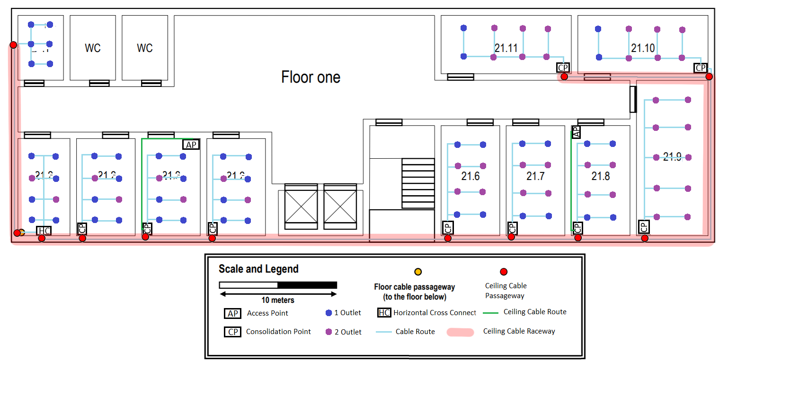

RCOMP 2020-2021 Project - Sprint 1 - Member 1191430 folder
===========================================
## Building 2:

## Ground Floor:

Room 20.1 is considered a storage room so there is no need to put any type of outlet there, as well as the bathrooms and corridors.

I decided to place the IC in room 20.2 because it is closer to the celling cable passageway and to the entrance, giving the possibility to access the next floor reducing the need for fiber optic cable type monomode.

Also I placed the HC with the same purpose, closest to the IC reducing the need for fiber optic cable type multimode.

I also decided to place consolidation points in all rooms to reduce the size of the cable used and the load overload.

Considering that the entire space must have access to wi-fi, I decided to strategically place 2 APs, one at the beginning of room 20.2 and another at the beginning of room 20.4, because their range is 50m in diameter, being possible to cover the entire floor.

I decided to put the HC and the IC in the same closet to reduce the space needed in the room to contain them.

Taking into account that the rule of at least 2 outlets per 10 m2 is followed.

#### Room 20.1:
   Dimensions:
   -. Length: 0.8cm → 4m | -. Width: 1.3cm → 6.5m
   -. Area: 26 m2

#### Room 20.2:
   Dimensions:
   -. Length: 2.7cm → 13.5m | -. Width: 1.5cm → 7.5m
   -. Area: 101.25 m2
   -. Calculations: [(101.25/10) * 2]
   Number of outlets: 22

#### Room 20.3:
   Dimensions:
   -. Length: 3cm → 15m | -. Width: 2cm → 10m
   -. Area: 150 m2
   -. Calculations: [(150/10) * 2]
   Number of outlets: 30

#### Room 20.4:
   Dimensions:
   -. Length: 4cm → 20m | -. Width: 1.8cm → 9m
   -. Area: 180 m2
   -. Calculations: [(180/10) * 2]
   Number of outlets: 36

#### Service desk (Brown surface):
   Dimensions:
   -. Length: 1.7cm → 8.5m | -. Width: 0.4cm → 2m
   -. Area: 17 m2
   -. Calculations: [(17/10) * 2]
   Number of outlets: 4

##### Total Number Outlets: 92

Room 20.2 (Total cable): 204 m
Room 20.3 (Total cable): 262 m
Room 20.4 (Total cable): 362 m
Service desk (Total cable): 30 m

HC → CP [Room 20.3] (Total cable): 28 m
HC → CP [Room 20.4] (Total cable): 43 m

##### Total Cable CAT6A: 934 m
##### Total Fiber Optic Cable Type Monomode: 41 m

#### Inventory:

* 1 IC:
    - Fiber Optic Patch Panel 24
    - Fiber Optic Switch 24

* 1 HC:
    - Coper Switch 48
    - Coper Patch Panel 48
    - Fiber Optic Patch Panel 24
    - Fiber Optic Switch 24

* 2 CP:
    - 2 Coper Switch 48
    - 2 Coper Patch Panel 48

* 92 Outlets
* 108 Patch Coords
* 934 m of CAT6A cable
* 40 m of Fiber Optic Cable Type Monomode
* 1m of Fiber Optic Cable Type Multimode
* 2 Access Points

## First Floor:

I decided to place the HC in room 21.2 because it is closer to the floor cable passageway, giving the possibility to access the previous floor reducing the need for fiber optic cable type multimode.

I also decided to place consolidation points in all rooms even though it will increase the size of the cable used, it will reduce the load overload.

Considering that the entire space must have access to wi-fi, I decided to strategically place 2 APs, one at the beginning of room 21.4 and another at the beginning of room 21.8, because their range is 50m in diameter, being possible to cover the entire floor.

#### Room 21.1:
Is a storage area and network outlets are not required there
   Dimensions:
   -. Length: 0.8cm → 4m | -. Width: 1.3cm → 6.5m
   -. Area: 26 m2
   -. Calculations: [(26/10) * 2]
   Number of outlets: 6

#### Room 21.2:
   Dimensions:
   -. Length: 1.8cm → 9m | -. Width: 1cm → 5m
   -. Area: 45 m2
   -. Calculations: [(45/10) * 2]
   Number of outlets: 10

#### Room 21.3:
   Dimensions:
   -. Length: 1.8cm → 9m | -. Width: 1cm → 5m
   -. Area: 45 m2
   -. Calculations: [(45/10) * 2]
   Number of outlets: 10

#### Room 21.4:
   Dimensions:
   -. Length: 1.8cm → 9m | -. Width: 1cm → 5m
   -. Area: 45 m2
   -. Calculations: [(45/10) * 2]
   Number of outlets: 10

#### Room 21.5:
   Dimensions:
   -. Length: 1.8cm → 9m | -. Width: 1cm → 5m
   -. Area: 45 m2
   -. Calculations: [(45/10) * 2]
   Number of outlets: 10

#### Room 21.6:
   Dimensions:
   -. Length: 2cm → 10m | -. Width: 1.1cm → 5.5m
   -. Area: 55 m2
   -. Calculations: [(55/10) * 2]
   Number of outlets: 12

#### Room 21.7:
   Dimensions:
   -. Length: 2cm → 10m | -. Width: 1.1cm → 5.5m
   -. Area: 55 m2
   -. Calculations: [(55/10) * 2]
   Number of outlets: 12

#### Room 21.8:
   Dimensions:
   -. Length: 2 cm → 8.5m | -. Width: 1.1cm → 5.5m
   -. Area: 55 m2
   -. Calculations: [(55/10) * 2]
   Number of outlets: 12

#### Room 21.9:
   Dimensions:
   -. Length: 2.8cm → 14m | -. Width: 1.3cm → 6.5m
   -. Area: 91 m2
   -. Calculations: [(91/10) * 2]
   Number of outlets: 20

#### Room 21.10:
   Dimensions:
   -. Length: 2.3cm → 11.5m | -. Width: 1cm → 5m
   -. Area: 57.5 m2
   -. Calculations: [(57.5/10) * 2]
   Number of outlets: 14

#### Room 21.11:
   Dimensions:
   -. Length: 2.3cm → 11.5m | -. Width: 1cm → 5m
   -. Area: 57.5 m2
   -. Calculations: [(57.5/10) * 2]
   Number of outlets: 14

##### Total Number Outlets: 124

Room 21.1 (Total cable): 122 m
Room 21.2 (Total cable): 58 m
Room 21.3 (Total cable): 58 m
Room 21.4 (Total cable): 58 m
Room 21.5 (Total cable): 58 m
Room 21.6 (Total cable): 80 m
Room 21.7 (Total cable): 80 m
Room 21.8 (Total cable): 80 m
Room 21.9 (Total cable): 156 m
Room 21.10 (Total cable): 98 m
Room 21.11 (Total cable): 98 m

HC → CP [Room 21.3] (Total cable): 3 m
HC → CP [Room 21.4] (Total cable): 9 m
HC → CP [Room 21.5] (Total cable): 16 m
HC → CP [Room 21.6] (Total cable): 38 m
HC → CP [Room 21.7] (Total cable): 44 m
HC → CP [Room 21.8] (Total cable): 50 m
HC → CP [Room 21.9] (Total cable): 56 m
HC → CP [Room 21.10] (Total cable): 77 m
HC → CP [Room 21.11] (Total cable): 88 m

##### Total Cable CAT6A: 1361  m
##### Total Fiber Optic Cable Type Multimode: 50 m

#### Inventory:

* 1 HC:
    - Fiber Optic Switch 24
    - Fiber Optic Patch Panel 24
    - Coper Switch 48
    - Coper Patch Panel 48

* 9 CP:
    - 9 Coper Switch 24
    - 9 Coper Patch Panel 24

* 124 Outlets
* 148 Patch Coords
* 1361 m of CAT6A cable
* 50 m of Fiber Optic Cable Type Multimode
* 2 Access Points

