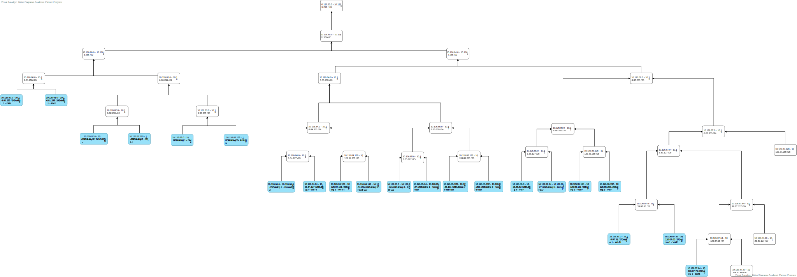

RCOMP 2019-2020 Project - Sprint 2 planning
===========================================
### Sprint master: 1191430 ###

# 1. Sprint's backlog #

|Task|Task Description|
|---------|-----------|
|T.2.1    |Development of a layer two and layer three Packet Tracer simulation for building 1, and also encompassing the campus backbone.Integration of every members’ Packet Tracer simulations into a single simulation.|
|T.2.2    |Development of a layer two and layer three Packet Tracer simulation for building 2, and also encompassing the campus backbone.|
|T.2.3    |Development of a layer two and layer three Packet Tracer simulation for building 3, and also encompassing the campus backbone.|
|T.2.5    |Development of a layer two and layer three Packet Tracer simulation for building 5, and also encompassing the campus backbone.|
# 2. Technical decisions and coordination #

#### Packet Tracer Version: 7.3.1

#### VTP Domain: rcompdlg1

#### IPv4 addresses range: 10.121.80.0/20 - 10.121.95.0/20

**VLANID = 1, is our default VLAN.**

#### Building 1                     
|VLAN Name      | VLAN ID       |
|---------------|---------------|
|Building1_GroundFloor|315|
|Building1_FirstFloor|316|
|Buidling1_Wifi|317|
|Building1_DMZ|318|
|Buidling1_VoIP|319|
|BackBone|340|

#### Building 2
|VLAN Name      | VLAN ID       |
|---------------|---------------|
|Building2_GroundFloor|320|
|Building2_FirstFloor|321|
|Buidling2_Wifi|322|
|Building2_DMZ|323|
|Buidling2_VoIP|324|
|BackBone|340|

#### Building 3
|VLAN Name      | VLAN ID       |
|---------------|---------------|
|Building3_GroundFloor|325|
|Building3_FirstFloor|326|
|Buidling3_Wifi|327|
|Building3_DMZ|328|
|Buidling3_VoIP|329|
|BackBone|340|

#### Building 5
|VLAN Name      | VLAN ID       |
|---------------|---------------|
|Building5_GroundFloor|330|
|Building5_FirstFloor|331|
|Buidling5_Wifi|332|
|Building5_DMZ|333|
|Buidling5_VoIP|334|
|BackBone|340|

# 3. Subtasks assignment #

**1191507:**
  - Development of a layer two and layer three Packet Tracer simulation for building 1, and also encompassing the campus backbone.
  - Integration of every members’ Packet Tracer simulations into a single simulation.

**1191430:**
  - Development of a layer two and layer three Packet Tracer simulation for building 2, and also encompassing the campus backbone.

**1181490:**
  - Development of a layer two and layer three Packet Tracer simulation for building 3, and also encompassing the campus backbone.

**1190693:**
  - Development of a layer two and layer three Packet Tracer simulation for building 5, and also encompassing the campus backbone.

# 4. IPV4 Mapping

|Building Nº|VLAN|Nodes|Address|Address Mask|Network Address|Broadcast Address|First Valid Network|Last Valid Network|
|-----------|----|-----|-------|------------|---------------|-----------------|-------------------|------------------|
|3|DMZ|250|10.126.80.0/24|255.255.255.0|10.126.80.0|10.126.80.255|10.126.80.1|10.126.80.254|
|5|DMZ|250|10.126.81.0/24|255.255.255.0|10.126.81.0|10.126.81.255|10.126.81.1|10.126.81.254|
|1|Backbone|120|10.126.82.0/25|255.255.255.128|10.126.82.0|10.126.82.127|10.126.82.1|10.126.82.126|
|2|WI-FI|100|10.126.82.128/25|255.255.255.128|10.126.82.128|10.126.82.255|10.126.82.129|10.126.82.254|
|1|DMZ|70|10.126.83.0/25|255.255.255.128|10.126.83.0|10.126.83.127|10.126.83.1|10.126.83.126|
|2|FirstFloor|70|10.126.83.128/25|255.255.255.128|10.126.83.128|10.126.83.255|10.126.83.129|10.126.83.254|
|2|GroundFloor|60|10.126.84.0/26|255.255.255.192|10.126.84.0|10.126.84.63|10.126.84.1|10.126.84.62|
|3|WI-FI|60|10.126.84.64/26|255.255.255.192|10.126.84.64|10.126.84.127|10.126.84.65|10.126.84.126|
|5|WI-FI|60|10.126.84.128/26|255.255.255.192|10.126.84.128|10.126.84.191|10.126.84.129|10.126.84.190|
|5|FirstFloor|45|10.126.84.192/26|255.255.255.192|10.126.84.192|10.126.84.255|10.126.84.193|10.126.84.254|
|3|FirstFloor|44|10.126.85.0/26|255.255.255.192|10.126.85.0|10.126.85.63|10.126.85.1|10.126.85.62|
|1|GroundFloor|40|10.126.85.64/26|255.255.255.192|10.126.85.64|10.126.85.127|10.126.85.65|10.126.85.126|
|1|FirstFloor|40|10.126.85.128/26|255.255.255.192|10.126.85.128|10.126.85.191|10.126.85.129|10.126.85.190|
|3|GroundFloor|40|10.126.85.192/26|255.255.255.192|10.126.85.192|10.126.85.255|10.126.85.193|10.126.85.254|
|3|VoIP|40|10.126.86.0/26|255.255.255.192|10.126.86.0|10.126.86.63|10.126.86.1|10.126.86.62|
|5|GroundFloor|40|10.126.86.64/26|255.255.255.192|10.126.86.64|10.126.86.127|10.126.86.65|10.126.86.126|
|5|VoIP|40|10.126.86.128/26|255.255.255.192|10.126.86.128|10.126.86.191|10.126.86.129|10.126.86.190|
|2|VoIP|35|10.126.86.192/26|255.255.255.192|10.126.86.192|10.126.86.255|10.126.86.193|10.126.86.254|
|1|WI-FI|24|10.126.87.0/27|255.255.255.224|10.126.87.0|10.126.87.31|10.126.87.1|10.126.87.30|
|1|VoIP|20|10.126.87.32/27|255.255.255.224|10.126.87.32|10.126.87.63|10.126.87.33|10.126.87.62|
|2|DMZ|12|10.126.87.64/28|255.255.255.240|10.126.87.64|10.126.87.79|10.126.87.65|10.126.87.78|

# 5. Static Routing Tables

## Routing Table Building nº 2

|    Building    |    Network     |      Mask       |    Next Hop   |     
|:--------------:|:--------------:|:---------------:|:-------------:|
|       3        |  10.126.80.0   | 255.255.255.0   |  10.126.82.2  |
|       5        |  10.126.81.0   | 255.255.255.0   |  10.126.82.4  |
|       3        |  10.126.84.64  | 255.255.255.192 |  10.126.82.2  |
|       5        |  10.126.84.128 | 255.255.255.192 |  10.126.82.4  |
|       5        |  10.126.84.192 | 255.255.255.192 |  10.126.82.4  |  
|       3        |  10.126.85.0   | 255.255.255.192 |  10.126.82.2  |
|       3        |  10.126.85.192 | 255.255.255.192 |  10.126.82.2  |
|       3        |  10.126.86.0   | 255.255.255.192 |  10.126.82.2  |
|       5        |  10.126.86.64  | 255.255.255.192 |  10.126.82.4  |   
|       5        |  10.126.86.128 | 255.255.255.192 |  10.126.82.4  |
|       1        |     0.0.0.0    |     0.0.0.0     |  10.126.82.3  |

# 6. Subnet Address Process

